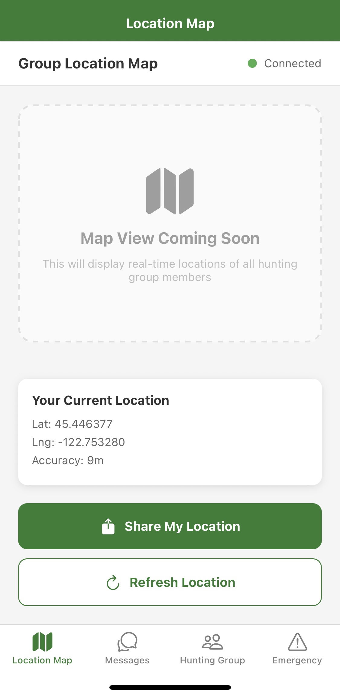
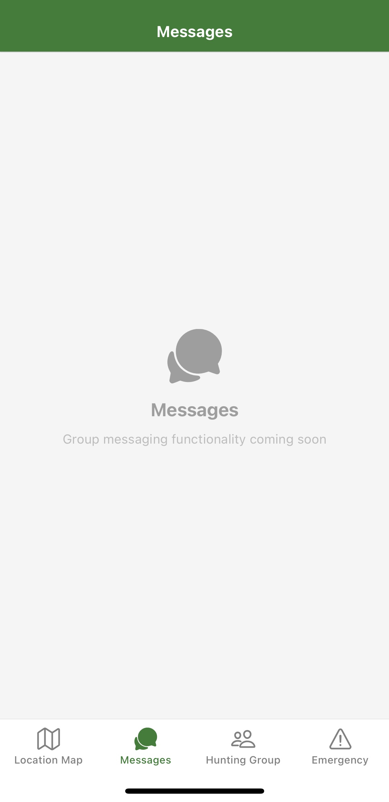
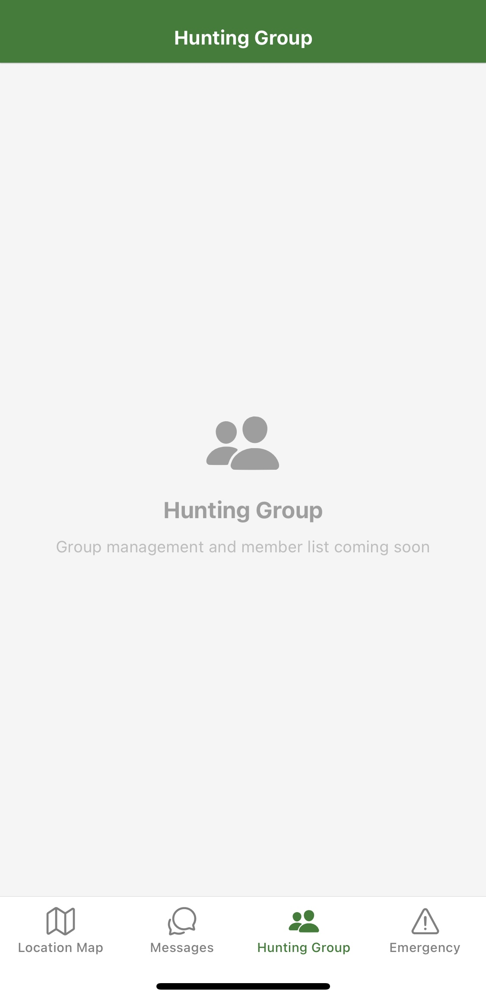
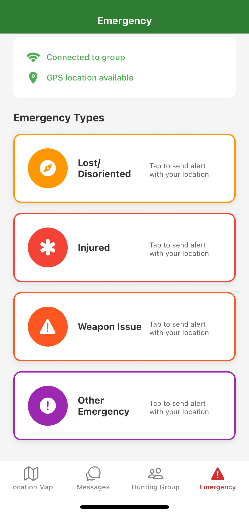

# Hunting Communication App

## Overview

A React Native mobile application built with Expo, this tool is designed for hunters to share GPS locations and communicate in remote areas where network coverage is unreliable. The app emphasizes user safety through real-time coordination and an offline-first design, directly addressing the critical challenges of communication and safety in remote hunting environments by leveraging modern mobile and web technologies for seamless interaction.

### Key Features

Real-time GPS Location Sharing: Hunters can share their positions live for group coordination.
Emergency Alerts: Send alerts with location data for quick response in critical situations.
Group Messaging: In-app messaging for communication within hunting groups.
Offline-First Design: Core functionality works without internet, syncing when connected.

### Tech Stack

- Frontend: React Native + Expo for cross-platform mobile development.

- Backend: Node.js + Express server handling API routes (auth, emergency, location, messages).

- Real-Time Communication: Socket.IO for live updates and messaging.

- Database: PostgreSQL for data persistence, with schema and initialization scripts.

**Services**: Dedicated socket services for emergency, location, and message handling.

### Project Structure

- Backend (/backend): Server setup, database config, API routes, and socket services.
- Mobile App (/mobile-app): App entry point, screens (Auth, Emergency, Group, Map, Messages), contexts (Auth, Location, Socket), and API config.

### Setup Instructions

- Backend: Navigate to /backend, run npm install, then npm run dev.
- Mobile App: Navigate to /mobile-app, run npm install, then npx expo start.

### Screenshots

Here are some screenshots of the mobile application:

- 
- 
- 
- 
